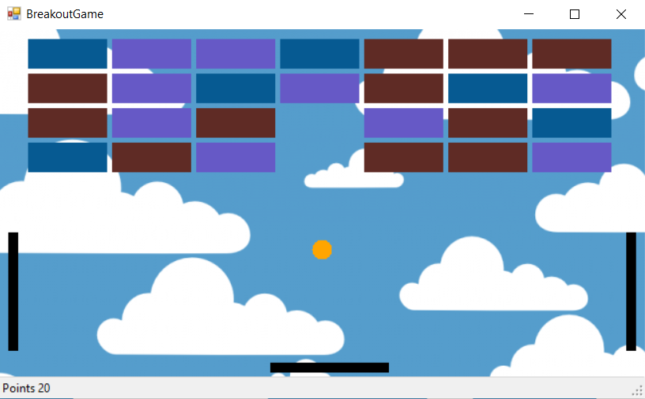
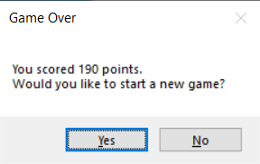
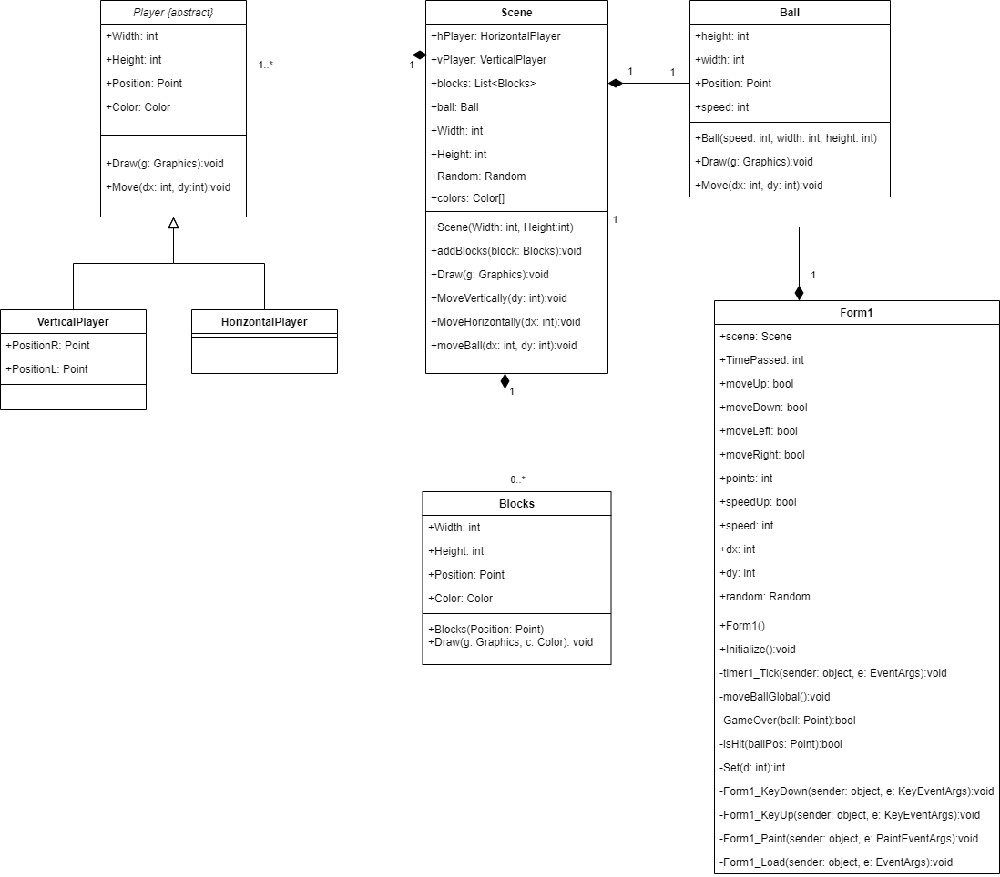

# Докумeнтација за играта Breakout Game
#### Изработено од Јонатан Милески и Мартин Петровски

Опис
-------

Овој проект претставува проширување на стандардната Breakout Game, со тоа што покрај хоризонталниот лизгач ние додадовме и два вертикални лизгачи кои исто така имаат за цел да го одбиваат топчето. Исто така начинот на имплементација е потолно наша идеја. Целта на оваа игра е игрчот со помош на хоризонталниот и вертикалниот лизгач да го одбива топчето и да се искршат сите цигли, што ќе резултира со победа на играта. Со секоја скршена цигла се добиваат плус 10 поени. Доколку играчот не успее да го одбие топчето со помош на лизгачките барови, и истото удри во долниот, левиот или десниот дел од прозорецот, играта завршува неуспешно, со што на играчот му се поставува прашање дали сака да продолжи со нова игра. Со текот на времето, како што се зголемува бројот на поени, така се зголемува и брзината на движење на точето, што прави играта да станува потешка и потешка.

GUI
---------
На сликата е прикажан главниот кориснички интерфејс, а тоа е самата околина за играње. Во горната половина се прикажани циглите, чија боја при секое стартување на играта е различна (случајно изгенерирана), додека пак најдолу од самиот прозорец се наоѓаат поените. Хоризонталниот и вертикалните барови се обоени во црна боја, а истите се придвижуваат со <code>&#8592;</code> <code>&#8593;</code> <code>&darr;</code> <code>&#8594;</code> копчињата од тастатура. Играчот смее да ги движи хоризонталниот и вертикалните барови истовремено. Двата вертикални барови се придвижуваат истовремено при кликање на копчињата за горе и долу од тастатура, додека пак хоризонталниот се движи само со копчињата за лево и десно. Бојата на топчето е секогаш жолта.


На следната слика е прикажан дијалогот кој се отвора во случај на пораз при играњето:<br>
<br>
Со клик на копчето "Yes" се исцртува нова игра во истиот прозорец во кој се играла претходната игра, додека пак со клик на копчето "No" и двата прозорци се затвораат.

Имплементација
---------
На сликата е прикажана класната хиерархија на целиот проект:



- Абстрактната класа Player се однесува на хоризонталниот и вертикалните лизгачки барови. За нив се чува должина и ширина (int),  една точка од објектот (од тип Point) и боја за самиот објект (Color). Исти такви информации се чуваат и за објект од тип Blocks кој претставува една цигла, додека пак за објект од типот Ball единствена разлика е што наместо боја се чува int вредност која претставува брзина. Во класата VerticalPlayer дополнително се чуваат PositionL и PositionR од типот Point.
- Во класата Scene се чуваат објекти од горенаведените класи, како и ширина и висина на сама сцена, и листа со случајно изгенерираните бои со кои треба да се обојат циглите.
- Главната класа, односно класата за самата форма, Form1, во себе чува еден податок од тип Scene, 4 логички променливи за тоа дали играчот активира движење на баровите лево, десно, горе или долу, број на поени (int), брзина, дали треба да се забрза (bool), и int вредности за променување на растојание на топчето од моменталната состојба до новата состојба (dx, dy). 
- Методот <code>Draw(...)</code> кој го имплементираат класите VerticalPlayer, HorizontalPlayer, Ball, Blocks, и Scene се користи за графичко исцртување на соодветните елементи на екран.
- Методот <code>Move(...)</code> кој го имплементираат класите VerticalPlayer, HorizontalPlayer и Ball се користи за поместување на соодветните елементи во зависност од предадените параметри.
- Методот <code>timer1_Tick(object sender, EventArgs e)</code> е користен од страна Timer вградената компонента, и се повикува на секое исктекување на тајмерот. Овој метод има задача да провери дали хоризонатлниот и/или вертикалните барови треба на екранот да се поместат, и ако треба ги повикува соодветните функции од Scene класата. Тоа се прави преку променливите moveUp, moveDown, moveLeft, moveRight, кои претходно се активираат со друга функција доколку играчот иницирал таков настан преку тастатурата. Исто така за да се поместат овие барови треба да е задоволен и условот тие да не ги надминуваат границите во кои им е дозволено движење. Откако ќе ги направи потребните промени на позицијата на баровите, овој метод е задолжен да го повика методот <code>moveBallGlobal()</code> кој ќе го помести точето доколку новата состојба е легална, и ќе провери дали топчето удрило во некоја цигла или не. Исто така методот <code>timer1_Tick(object sender, EventArgs e)</code> треба да ги ажурира поените кои се наоѓаат на лентата за поени, и да ја забрза брзината на движење на топчето доколку се задоволени одредени услови. Кодот на оваа фукнција е прикажан подолу:
  
  ```
  private void timer1_Tick(object sender, EventArgs e)
        {
            if(moveUp == true && scene.vPlayer.PositionL.Y >= 10)
            {
                scene.MoveVerticaly(-(int)(speed * 1.5));
            }
            if(moveDown == true && scene.vPlayer.PositionL.Y+120 < this.Height-80)
            {
                scene.MoveVerticaly((int)(speed * 1.5));
            }
            if(moveLeft == true && scene.hPlayer.Position.X >= 30)
            {
                scene.MoveHorizontaly(-(int)(speed * 1.5));
            }
            if(moveRight == true && scene.hPlayer.Position.X + 120 < this.Width-40)
            {
                scene.MoveHorizontaly((int)(speed * 1.5));
            }
            moveBallGlobal();

            toolStripStatusLabel1.Text = "Points " + points;

            if (points % 100 == 0 && points >= 100 && speedUp == true) 
            {
                speed += 5;
                speedUp = false;
            }

            Invalidate(true);
        }
  ```
